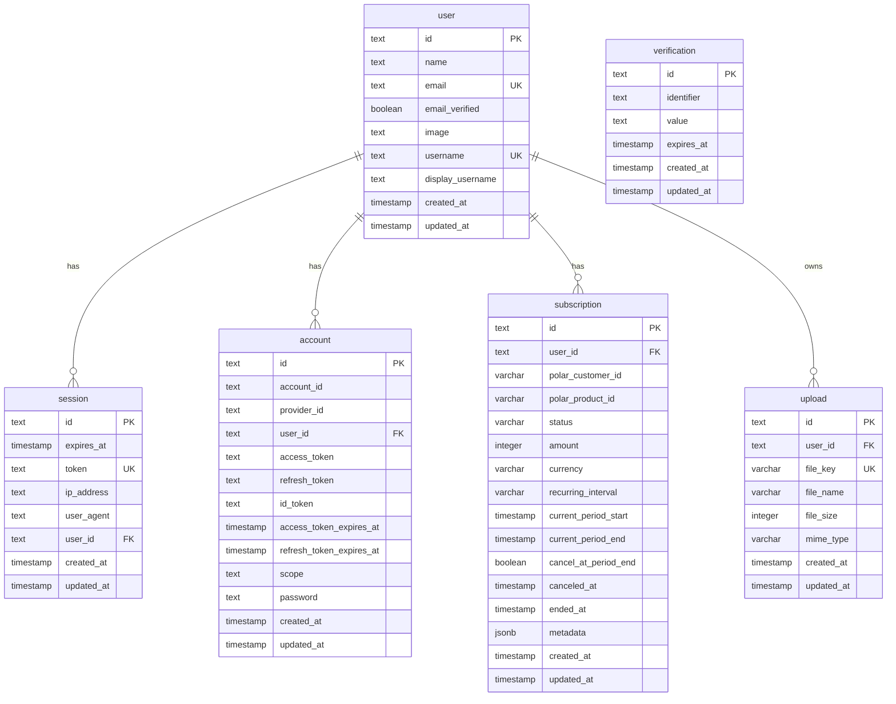

# Database model

> Update this file in a separate commit whenever the database schema changes.
> Run `bun run --filter './server' db:doc` to regenerate the mermaid skeleton
> from the current `server/src/db/schema/`.

## ER diagram

## Tables

### `user`

The application's identity table, owned by BetterAuth (with the `username` plugin enabled — `username` and `display_username` are added by that plugin). Holds the public profile fields (name, email, image) plus the email-verification flag. Every other domain table that belongs to a user references `user.id` with `ON DELETE CASCADE`.

### `session`

BetterAuth session storage. One row per active sign-in. The `token` is the cookie value; `expires_at` drives session expiry. `ip_address` and `user_agent` are recorded at creation for audit. The middleware in `server/src/middleware/auth.ts` reads sessions via `auth.api.getSession({ headers })`.

### `account`

BetterAuth credential store. Each row is one (provider, accountId) pair belonging to a user. For email/password the row carries the salted password hash in `password`; for any future OAuth provider it carries access/refresh tokens. `provider_id = 'credential'` for email/password.

### `verification`

BetterAuth's short-lived token store: email-verification links, password-reset tokens, etc. `identifier` is the target (usually the email), `value` is the token, `expires_at` enforces the window.

### `subscription`

Local mirror of the user's Polar subscription state. Polar webhooks (`/api/webhooks/polar`) write to this table when a subscription is created, activated, updated, or revoked. Columns split into Polar identity (`polar_customer_id`, `polar_product_id`), billing state (`status`, `amount`, `currency`, `recurring_interval`, `current_period_*`), and cancellation metadata. The app reads `subscription` for entitlement decisions instead of calling Polar at request time.

### `upload`

Index of files stored in Cloudflare R2. `file_key` is the canonical R2 object key (unique). `file_size` and `mime_type` are recorded at presign time and validated at the `/api/uploads/complete` step. View/download endpoints look up by `id`, verify `user_id` ownership, and return short-lived presigned GET URLs.
